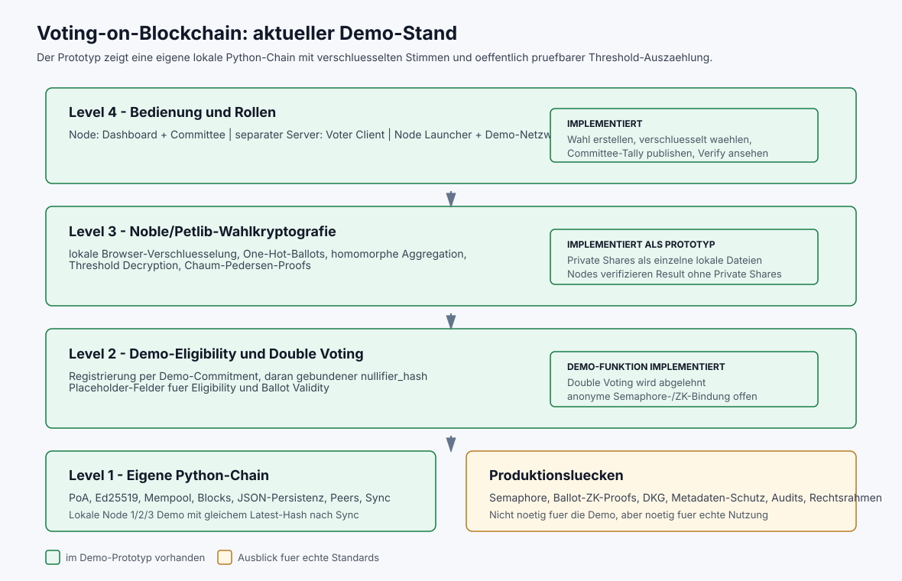
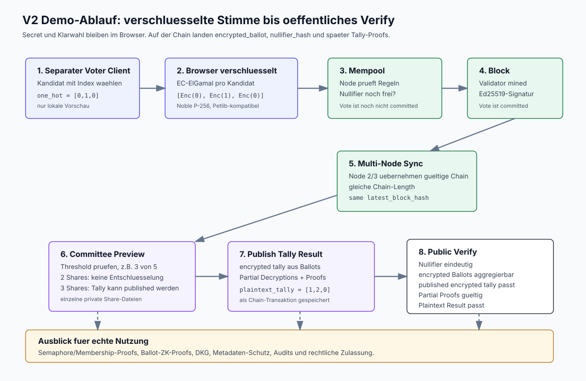

# Blockchain-basiertes Wahlsystem

Praesentationsfaehiger Lernprototyp fuer ein verteiltes und oeffentlich
pruefbares Wahlsystem. Der aktuelle V2-Weg kombiniert eine eigene
Python-Blockchain, drei getrennte Nodes, lokale Browser-Verschluesselung,
homomorphe Auszaehlung und 3-aus-5-Threshold-Decryption.

Das Projekt ist kein produktives E-Voting-System. Es demonstriert den
technischen Datenfluss und benennt die fehlenden Sicherheitsbausteine offen.

## Was der Prototyp zeigt

- getrennte Validator- und Observer-Nodes mit eigenen `DATA_DIR`s
- Mempool, signierte PoA-Blocks, Peer-Sync und JSON-Persistenz
- Wahlverwaltung mit Kandidaten-Indizes und Committee-Public-Key
- lokale P-256-EC-ElGamal-Verschluesselung im Voter-Browser
- keine Namen, Voter-Secrets oder Klarstimmen in Node-Requests und Chain
- deterministisch an ein registriertes Commitment gebundene Demo-Nullifier
- homomorphe Addition aller encrypted Ballots
- private Committee-Shares als einzelne lokale JSON-Dateien
- clientseitige Partial Decryptions und Chaum-Pedersen-Proofs
- Petlib-Verifikation des veroeffentlichten Ergebnisses auf jeder Node
- getrennte Oberflaechen fuer Node, Voter und Committee

Der aktuelle Nullifier ist absichtlich nur eine robuste Demo-Loesung: Seine
Bindung an das oeffentliche Commitment verhindert frei erfundene Nullifier,
ist aber nicht anonym. Ein produktives System braucht dafuer einen echten
ZK-Membership-/Nullifier-Proof, zum Beispiel nach dem Semaphore-Prinzip.

## Datenfluss

1. Das Dashboard erzeugt Committee-Keymaterial lokal im Browser.
2. Nur Public Key und Public Shares gehen in `create_election` auf die Chain.
3. Jeder private Member-Share wird als eigene Datei gespeichert.
4. Der Voter-Browser bildet One-Hot, Commitment und Nullifier lokal.
5. Die Node erhaelt nur `encrypted_ballot`, Hashes und Proof-Platzhalter.
6. Der Validator committed gueltige Mempool-Transaktionen in einen Block.
7. Committee-Mitglieder laden mindestens den Threshold einzelner Share-Dateien.
8. Der Committee-Browser aggregiert, entschluesselt den Tally und erzeugt Proofs.
9. Jede Node prueft Tally, Partial Decryptions und Klarergebnis mit Petlib.

## Rollen

- **Admin:** darf `create_election` und `finalize_election` einreichen.
- **Node Operator:** darf Peers aendern, synchronisieren und Blocks minen.
- **Voter:** registriert ein Demo-Commitment und sendet encrypted Ballots.
- **Committee:** publiziert nur einen kryptografisch gueltigen Threshold-Tally.
- **Observer:** liest Chain-Daten und verifiziert das Ergebnis ohne private Shares.

Die V2-API verwendet fuer die beiden privilegierten Rollen die Header
`X-Admin-Key` und `X-Node-Key`. Defaults der lokalen Demo sind
`dev_admin_key` und `dev_node_key`.

## Projektstruktur

```text
voting_system/     FastAPI, Chain-Core und Petlib-Kryptografie
web/               Dashboard, Voter, Committee und Browser-Crypto
scripts/           Node Controller, Demo-Netzwerk und CLI-Client
tests/             Python-, HTTP-Prozess- und Interoperabilitaetstests
tests_js/          Browser-Kryptografie-Tests
docs/              Anleitungen und Architekturdiagramme
archive/            nicht aktiver Ethereum-/Hardhat-Entwurf
blockchainV1.py    kompatibler Start-Wrapper
```

Der aktive Prototyp ist die V2-Chain in
`voting_system/distributed_blockchain.py`. Die alte V1-Lerndemo bleibt in
`voting_system/blockchain_v1.py` erhalten.

## Installation

```bash
python3 -m venv .venv
source .venv/bin/activate
.venv/bin/pip3 install -r requirements.txt
```

Das fertige Browser-Crypto-Bundle liegt unter
`web/assets/voting_crypto.bundle.js`. Nur fuer Aenderungen daran werden Node.js
und npm benoetigt:

```bash
npm install
npm run build:web-crypto
```

## Start

Empfohlen fuer die Praesentation:

```bash
.venv/bin/python scripts/v2_node_launcher.py
```

Im Controller `3-Node-Demo starten` waehlen. Danach:

```text
Dashboard: http://127.0.0.1:5001/dashboard
Voter:     http://127.0.0.1:5001/voter
Committee: http://127.0.0.1:5001/committee
Node 2:    http://127.0.0.1:5002/dashboard
Node 3:    http://127.0.0.1:5003/dashboard
API Docs:  http://127.0.0.1:5001/docs
```

Alternativ direkt:

```bash
.venv/bin/python scripts/run_v2_demo_network.py --reset
```

Eine einzelne Node:

```bash
PORT=5001 \
V2_ADMIN_KEY=dev_admin_key \
V2_NODE_KEY=dev_node_key \
.venv/bin/python blockchainV1.py
```

## Bedienung

1. Im Dashboard Wahl erstellen und jeden Committee-Share einzeln speichern.
2. Im Voter Client Wahl laden, Secret eingeben und registrieren.
3. Dashboard: Mempool als Block minen.
4. Voter Client: Kandidat waehlen und encrypted Vote senden.
5. Dashboard: Vote-Block minen und Observer-Nodes synchronisieren.
6. Dashboard: `finalize_election` mit Admin-Key senden und minen.
7. Committee Client: mindestens Threshold Share-Dateien laden und Tally senden.
8. Dashboard: Tally-Block minen und `Verify` ausfuehren.

`result_status=verified` und `complete=true` bedeuten, dass ein publiziertes
Ergebnis vollstaendig gegen die committed encrypted Ballots geprueft wurde.
Ein offener Wahlzustand kann eine gueltige Chain haben, ist aber noch kein
verifiziertes Endergebnis.

## Tests

```bash
.venv/bin/python -m unittest discover -s tests
npm run test:web-crypto
```

Die Tests umfassen unter anderem:

- Petlib EC-ElGamal und Threshold-Proofs
- Browser-Noble-Payloads gegen Python/Petlib
- Nullifier-Bindung und Double-Voting-Ablehnung
- Admin-/Node-Rollenkeys
- drei echte FastAPI-Prozesse mit HTTP-Sync
- Auslieferung aller drei GUIs und des Crypto-Bundles

## Bewusste Grenzen

- keine echten Semaphore-/Membership-Proofs
- kein ZK-Ballot-Proof fuer genau eine verschluesselte Auswahl
- Demo-Registrierung ist keine reale Ausgabe von Wahlberechtigungen
- private Share-Dateien haben noch keinen Hardware-/Passwortschutz
- einfacher PoA-Konsens und manuell angestossener Peer-Sync
- keine BFT-Fork-Aufloesung, Datenbank oder parallele Transaktionssperren
- kein Schutz gegen IP-, Timing- und Reihenfolge-Metadaten
- keine formale Sicherheitsanalyse, Audits oder rechtliche Zulassung

Der alte Ethereum-/Semaphore-Entwurf liegt nur noch als Forschungsreferenz
unter `archive/ethereum-experiment/` und ist kein aktiver Buildpfad.

## Grafiken




